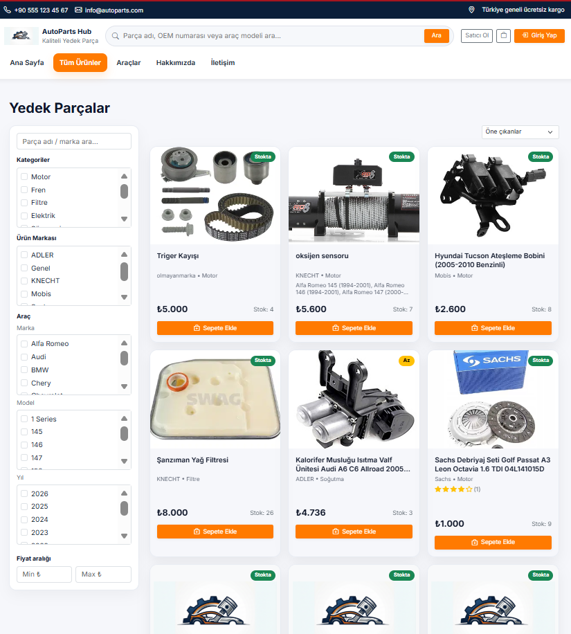
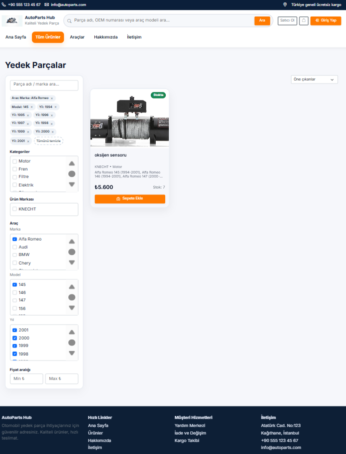
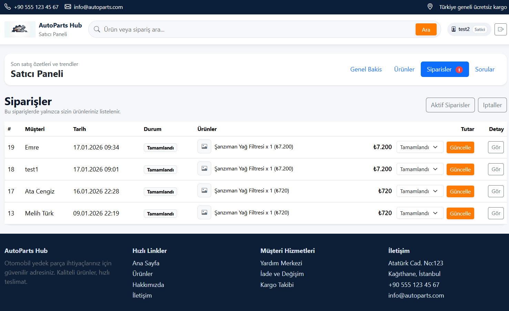
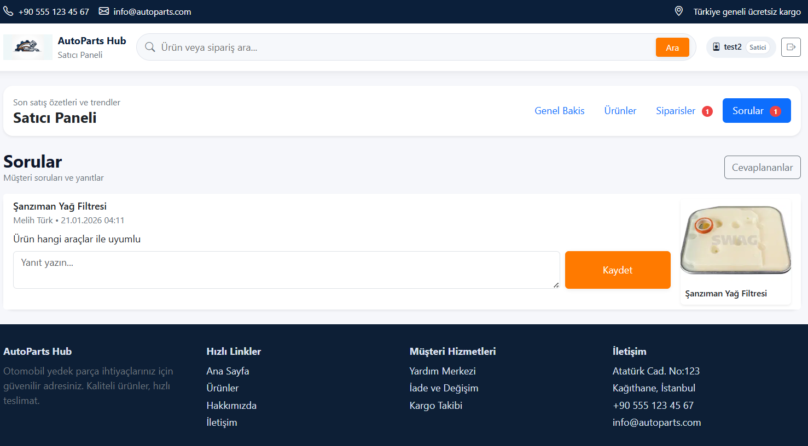
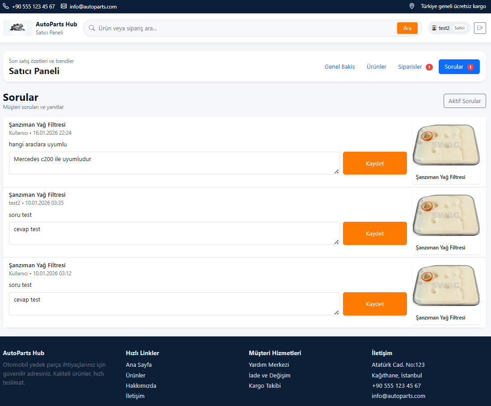
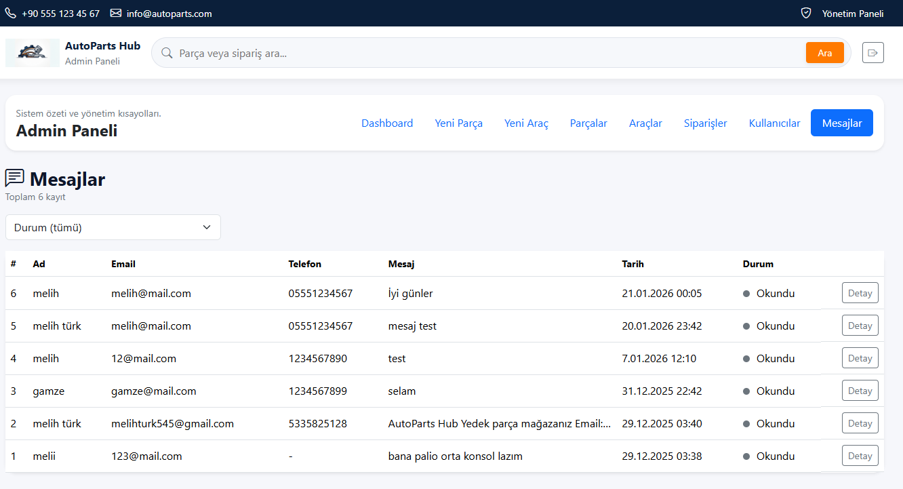

# AutoParts Hub — Yedek Parça Marketplace (ASP.NET Core MVC)

AutoParts Hub; **satıcıların** otomobil yedek parçalarını listeleyip satabildiği, **müşterilerin** araç uyumluluğuna göre doğru parçayı bulup sipariş verebildiği, **admin’in** ise katalog + operasyonu yönettiği **pazar yeri (marketplace)** web uygulamasıdır.

> **Geliştirici:** Melih Türk  
> **YouTube Demo Videosu:** ``

> ## Ekran Görüntüleri

---

### Ana Sayfa – Hızlı Arama & Araç Uyumluluk Araması
- Ana sayfada kullanıcı; parça adı/OEM/araç modeli ile **hızlı arama** yapabilir.
- Sağ tarafta **Marka–Model–Yıl** seçimi ile araç uyumluluğuna göre filtreleme başlatılır.
- Kategori kısayolları ile (Motor, Filtre, Soğutma vb.) keşif akışı hızlandırılır.

---

### Satıcı Başvurusu – Satıcı Ol Formu
- Satıcı olmak isteyen kullanıcılar; ad-soyad, e-posta, firma, telefon vb. bilgilerle başvuru yapar.
- Şifre politikası ve temel doğrulamalar ile güvenli kayıt akışı desteklenir.

---

### Araçlar – Marka/Model/Yıl Bazlı Katalog
- Kullanıcılar araç markasını seçer; ilgili **model kartları** ve **yıl aralıkları** üzerinden parçaları filtreler.
- Araç seçimi sonrası uyumlu parçalar listelenerek doğru parça bulunması kolaylaşır.

---

### Ürünler – Gelişmiş Filtreleme Paneli
- Sol panelde; kategori, marka, araç (marka/model/yıl) ve fiyat aralığı gibi filtreler bulunur.
- Seçili filtreler etiket olarak gösterilir; kullanıcı hızlıca temizleyip yeniden arama yapabilir.

---

## Ürün Detay Akışı

### Ürün Detay – Genel Bilgiler (Uyumluluk + Stok + Satıcı)
- Ürün detay sayfasında; uyumluluk listesi, stok, satıcı bilgisi ve açıklamalar tek ekranda sunulur.
- Kullanıcı adet seçip sepete ekleyerek satın alma akışını başlatır.

---

### Ürün Detay – Soru–Cevap, Puan & Yorum
- Müşteri ürün hakkında soru sorabilir; satıcı panelinden yanıtlanır.
- Satın alma sonrası kullanıcı; yıldız puan + yorum ile değerlendirme yapabilir.

---

### Ürün Detay – Benzer Ürünler / “Bunlara da Göz At”
- Sayfa alt bölümünde “Benzer Ürünler” ve “Bunlara da göz at” alanları ile keşif desteklenir.
- Kullanıcı, ilgili ürünlere hızlı geçiş yaparak alışverişi sürdürebilir.

---

### İletişim – Bize Yazın Formu
- Ziyaretçiler; ad-soyad, e-posta, telefon ve mesaj içeriği ile iletişim kurabilir.
- Sağ blokta mağaza iletişim bilgileri sabit gösterilerek güven artırılır.

---

### Girişli Ana Sayfa – Kullanıcı Durumu & Navigasyon
- Kullanıcı giriş yaptıktan sonra menüde **profil/siparişlerim** gibi alanlara erişim sağlanır.
- Alışveriş akışı kesintisiz şekilde ana sayfa üzerinden devam eder.

---

### Siparişlerim – Kullanıcı Sipariş Listesi
- Kullanıcı kendi siparişlerini listeler; sipariş satırında ürün, adet, tutar ve durum bilgisi görülür.
- İptal/işlem butonları ile sipariş yönetimi yapılabilir.

---

### Profil – Hesap Bilgileri & Hızlı Aksiyonlar
- Profil sayfasında ad-soyad, e-posta ve rol gibi bilgiler görüntülenir.
- “Profili Düzenle / Siparişlerim / Alışverişe Devam Et” gibi hızlı aksiyonlar sunulur.

---

## Satıcı Paneli

### Satıcı Dashboard – Gelir Özetleri & Grafikler
- Satıcı; günlük/haftalık/aylık/yıllık gelir özetlerini takip eder.
- “7 Günlük Satış” ve “Ürün Bazlı Gelir” grafikleri ile performans izlenir.

---

### Satıcı – Ürünlerim (Listeleme + Stok Güncelleme)
- Satıcı ürünlerini listeler; stok **artır/azalt** kontrolleri ile hızlı güncelleme yapar.
- Düzenleme ekranına geçiş ile ürün bilgileri yönetilir.

---

### Satıcı – Siparişler (Yeni/Aktif Siparişler)
- Satıcıya gelen yeni siparişler listelenir.
- Durum değiştirme (ör. Beklemede → Kargolandı/Tamamlandı) ve güncelleme akışı vardır.

---

### Satıcı – Siparişler (Liste/Geçmiş)
- Satıcı, siparişleri durumuna göre görüntüler (aktif/tamamlanan vb.).
- Sipariş satırında müşteri, ürün, tarih ve tutar bilgileri birlikte görülür.

---

### Satıcı – Sorular (Yanıtlama)
- Müşterilerin ürün soruları satıcı panelinde gösterilir.
- Satıcı yanıt yazar, kaydeder; müşteri ürün detay sayfasından yanıtı görür.

---

### Satıcı – Sorular (Liste)
- Birden fazla soru kaydı listelenir; aktif sorular hızlıca yanıtlanabilir.
- Ürün görseli ve içerik kartları ile ekran okunabilirliği artırılır.

---

## Admin Paneli

### Admin – Parça Listesi (Arama + Yönetim)
- Admin, parçaları listeler ve arama alanı ile filtreler.
- Stok artır/azalt kontrolleri, düzenleme butonları ile katalog yönetilir.

---

### Admin Dashboard – Sistem Metrikleri & Grafikler
- Toplam parça/araç/kullanıcı/satış gibi KPI’lar özetlenir.
- Satış grafikleri ve “En Çok Satan Ürünler / En Çok Satış Yapan Satıcılar” panelleri sunulur.

---

### Admin – Araç Yönetimi (Listeleme)
- Admin; marka, model, yıl ve motor alanlarıyla araç kayıtlarını yönetir.
- Arama alanı ile hızlı filtreleme yapılır.

---

### Admin – Yeni Araç Ekle (Form + CSV Aktarımı)
- Admin yeni araç ekleyebilir; görsel URL ve motor gibi alanları opsiyonel yönetir.
- CSV aktarımı ile toplu araç kaydı desteklenir.

---

### Admin – Mesajlar (Listeleme)
- İletişim formundan gelen mesajlar admin panelinde listelenir.
- Liste üzerinde ad, e-posta, telefon, mesaj özeti, tarih ve durum bilgisi görülür.

---

### Admin – Mesaj Detay
- Mesaj detayı; ad, e-posta, telefon ve içerik ile birlikte görüntülenir.
- Okundu/Yeni durumu takip edilerek yönetim kolaylaşır.

---

### Admin – Mesajlar (Yeni/Okundu Yönetimi)
- Liste ekranında mesaj durumları (Yeni/Okundu) kolayca izlenir.
- Durum aksiyonları ile mesajlar operasyonel olarak yönetilebilir.

---

### Admin – Sipariş Yönetimi (Aktif Siparişler)
- Siparişler müşteri/e-posta ile aranabilir, durum ve tarih aralığı ile filtrelenebilir.
- Sipariş satırında ürünler, toplam tutar ve durum bilgisi izlenir; detaya geçiş yapılır.

---

### Admin – Sipariş Yönetimi (Tamamlananlar)
- Tamamlanan siparişler ayrı listelenir; raporlama ve takip kolaylaşır.
- Ürün kırılımı ile çoklu ürün siparişleri net şekilde gösterilir.

---

### Admin – Kullanıcı & Satıcı Yönetimi
- Kullanıcıların rolü (User/Admin) yönetilebilir.
- Satıcılar listelenir; askıya alma/silme gibi işlemler uygulanabilir.
- Onay bekleyen satıcı başvuruları izlenebilir.

---

### Admin – Sipariş Yönetimi (Özet Liste)
- Yönetim tarafında siparişlerin genel görünümü listelenerek hızlı operasyon yapılır.
- Durum etiketleri ile (Beklemede/Tamamlandı vb.) süreç izlenir.

---

### Admin – Yeni Parça Ekle (Ürün Yönetimi)
- Parça adı, marka (gerekirse yeni marka), kategori, durum, fiyat, stok alanları doldurulur.
- Görsel URL veya dosya yükleme (ana görsel + galeri) desteklenir.
- Parça, uyumlu araçlarla ilişkilendirilebilir.

